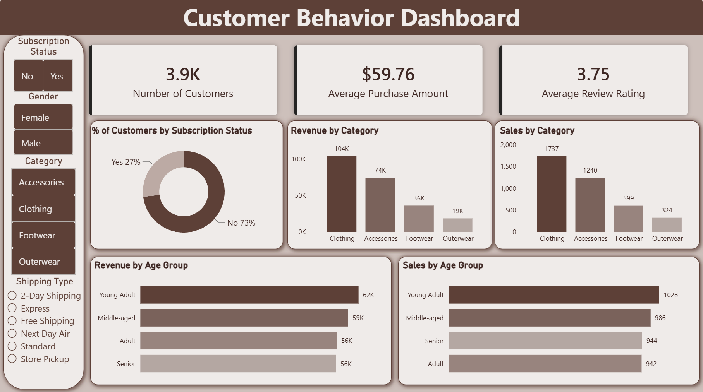

# 🛒 Customer Shopping Behavior Analysis

> End-to-end data analytics project — from raw data cleaning in **Python**, to structured querying in **SQL**, to interactive reporting in **Power BI**.

---

## 📌 Project Overview

This project analyzes **3,900 customer shopping records** to uncover purchasing patterns, customer segmentation, and revenue drivers. The goal is to provide actionable business insights through a complete analytics pipeline.

---

## 📂 Project Structure

| File | Description |
|------|-------------|
| `customer_shopping_behavior.csv` | Raw dataset (3,900 records × 18 columns) |
| `python.ipynb` | Data cleaning & feature engineering notebook |
| `custmer_sql_queries.sql` | 10 business-focused SQL queries |
| `Customer Behavior Dashboard.pbix` | Power BI interactive dashboard |
| `Dashboard.png` | Dashboard screenshot |
| `Analysis Project.pdf` | Final analysis report |
| `Business Problem Document.pdf` | Business problem definition |

---

## 📊 Dataset Summary

- **Records:** 3,900 customers
- **Columns:** 18 features (demographics, purchases, preferences)

| Feature | Type | Examples |
|---------|------|----------|
| Age | Numeric | 18–70 |
| Gender | Categorical | Male, Female |
| Category | Categorical | Clothing, Accessories, Footwear, Outerwear |
| Purchase Amount (USD) | Numeric | $20–$100 |
| Review Rating | Numeric | 2.5–5.0 |
| Shipping Type | Categorical | Express, Free Shipping, Standard, etc. |
| Payment Method | Categorical | PayPal, Credit Card, Cash, etc. |
| Previous Purchases | Numeric | 1–50 |

---

## 🐍 Phase 1: Python — Data Cleaning & Feature Engineering

**File:** `python.ipynb`

### Steps Performed

1. **Data Exploration** — `df.head()`, `df.info()`, `df.describe()`
2. **Missing Values** — 37 nulls in `Review Rating` → filled with **category-wise median**
3. **Column Standardization** — Renamed columns to `snake_case` (e.g., `Purchase Amount (USD)` → `purchase_amount`)
4. **Feature Engineering:**
   - **`age_group`** — Binned ages into 4 groups using `pd.qcut`: *Young Adult, Adult, Middle-aged, Senior*
   - **`purchase_frequency_days`** — Mapped text frequencies to numeric days (e.g., Weekly → 7, Annually → 365)
5. **Redundancy Removal** — Dropped `promo_code_used` (100% identical to `discount_applied`)
6. **Database Export** — Loaded cleaned data into **MySQL** (`s2.customer_shopping_behavior`) via `SQLAlchemy`

---

## 🗃️ Phase 2: SQL — Business Analysis

**File:** `custmer_sql_queries.sql`

### 10 Key Queries

| # | Business Question | Technique |
|---|-------------------|-----------|
| Q1 | Revenue by Gender | `GROUP BY` + `SUM` |
| Q2 | Discount users spending above average | Subquery + `WHERE` |
| Q3 | Top 5 products by review rating | `AVG` + `ORDER BY` + `LIMIT` |
| Q4 | Standard vs Express shipping spend | Filtered `GROUP BY` |
| Q5 | Subscriber vs Non-subscriber revenue | `COUNT` + `AVG` + `SUM` |
| Q6 | Top 5 discount-heavy products | `CASE WHEN` + percentage calc |
| Q7 | Customer segmentation (New/Returning/Loyal) | `CTE` + `CASE WHEN` |
| Q8 | Top 3 products per category | `ROW_NUMBER()` window function |
| Q9 | Repeat buyers & subscription correlation | Filtered aggregation |
| Q10 | Revenue by age group | `GROUP BY` + `ORDER BY` |

---

## 📈 Phase 3: Power BI — Dashboard

**File:** `Customer Behavior Dashboard.pbix`

### Dashboard Highlights

- **KPI Cards:** Total Customers (3.9K) · Avg Purchase ($59.76) · Avg Rating (3.75)
- **Donut Chart:** Subscription split — 73% Non-subscribers / 27% Subscribers
- **Bar Charts:** Revenue & Sales by Category and Age Group
- **Slicers/Filters:** Subscription Status, Gender, Category, Shipping Type

### Key Insights from Dashboard

| Insight | Detail |
|---------|--------|
| Top Category | **Clothing** — 1,737 sales, ~$104K revenue |
| Highest Spending Age Group | **Young Adult** — $62K revenue |
| Subscription Rate | Only **27%** of customers are subscribers |
| Category Ranking | Clothing > Accessories > Footwear > Outerwear |

---

## 🔑 Key Findings

1. **Clothing dominates** — highest in both sales count and revenue
2. **Young Adults** are the most valuable customer segment by revenue
3. **Low subscription rate (27%)** — opportunity to improve retention programs
4. **Discounts don't always mean lower spend** — many discount users spend above average
5. **All 4 age groups** contribute relatively balanced revenue ($56K–$62K)

---

## 🛠️ Tools & Technologies

| Tool | Purpose |
|------|---------|
| **Python** (Pandas, SQLAlchemy, PyMySQL) | Data cleaning & feature engineering |
| **MySQL** | Data storage & SQL analysis |
| **Power BI** | Interactive dashboard & visualization |
| **Jupyter Notebook** | Development environment |

---

## 🚀 How to Run

1. **Python Notebook:** Open `python.ipynb` in Jupyter and run all cells (requires `pandas`, `sqlalchemy`, `pymysql`)
2. **SQL Queries:** Execute `custmer_sql_queries.sql` in MySQL Workbench or any SQL client
3. **Power BI:** Open `Customer Behavior Dashboard.pbix` in Power BI Desktop

---

## 🖼️ Dashboard Preview

